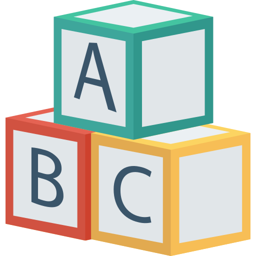

<div id="top"></div>

<br/>
<div align="center">
    
    <h1 align="center">Buraco nas Letras</h1>
    <p align="center">Console Application, Web MVC e Web API</p>
</div>

<br/>

<div align="center">
    <a href="https://github.com/YuriSiman/buraco-nas-letras/blob/master/LICENSE" target="_blank">
      
    </a>
    <a href="https://github.com/YuriSiman" target="_blank">
      
    </a>
    <a href="https://yurisiman.com.br" target="_blank">
      
    </a>
    <a href="https://www.linkedin.com/in/yurisiman/" target="_blank">
      
    </a>
    <a href="mailto:contato@yurisiman.com.br" target="_blank">
      
    </a>
</div>

<br/>

## :clipboard: Sobre o Projeto

Este projeto se trata de um desafio para praticar a construção de projetos em Console Application, Web API e Web MVC com o dotnet e c#. Ele está distribuído entre camadas, sendo que a Web Api e o Web Mvc utilizam as mesmas validações que constam na camada Console Application.

O projeto consiste em aplicações desenvolvidas em .NET 5.0:

- Console Application
- ASP.NET Core Web Api
- ASP.NET Core Web App (Model-View-Controller)

---

## :pencil: Pré-requisitos

1. Construído com .NET 5.0 e codificado em C#, se você não possui o dotnet instalado, acesse [aqui](https://dotnet.microsoft.com/) e instale a versão mais recente.
2. Clone este repositório em sua máquina local

   ```sh
   git clone https://github.com/YuriSiman/buraco-nas-letras.git
   ```

---

## :dart: Tópicos do Desafio

<details>
  <summary>Projetos</summary>
  <ul>
    <li><a href="#console-app">Console Application</a></li>
    <li><a href="#web-app-mvc">Web App MVC</a></li>
    <li><a href="#web-app-api">Web API</a></li>
  </ul>
</details>

---

## :rocket: Vamos Começar

### Desafio Buraco nas Letras

<div id="console-app"></div>

### Console Application   

Desenvolva um programa que leia do usuário um texto qualquer e retorne a quantidade de buracos existente em cada letra do texto.

Requisitos do Desafio:

- A solução deve conter um projeto em console que receba um texto qualquer e imprima:

  - Texto inserido
  - Tamanho do texto
  - Total de palavras
  - Total de buracos no texto

- Considere que não haverá acentuação nas palavras

- Lembre-se de considerar letras maiúsculas, minúsculas e números

<p align="right"><a href="#top">Início ↑</a></p>

---
<div id="web-app-mvc"></div>

### Web App MVC   

Crie uma aplicação Web MVC básica que utilize o código do desafio anterior em console. O usuário deve ser capaz de:

- Inserir um texto qualquer
- Visualizar o tamanho do texto
- Visualizar o total de palavras no texto
- Visualizar o total de buracos no texto

<p align="right"><a href="#top">Início ↑</a></p>

---

<div id="web-app-api"></div>

### Web API  

Crie uma API simples que possua um único método e que utilize o código do desafio em console. Ela deve receber um texto qualquer através de uma requisição POST e retornar um JSON no formato abaixo:

```json
{
  "texto": "TEXTO ENVIADO NA REQUISICAO",
  "tamanho": 27,
  "totalDePalavras": 4,
  "totalDeBuracos": 8
}
```

Os dados foram persistidos no banco com o EntityFramework, utilizando um contexto de dados e mapeando a entidade com Fluent API. Foi implementada uma chamada para um banco de dados local utilizando Sql Server e Migrations para o versionamento do banco. Para a última implementação foi criada uma API para executar um método POST passando apenas o texto e retornando um JSON com as informações solicitadas. A API está documentada com o Swagger para facilitar a sua visualização.

<p align="right"><a href="#top">Início ↑</a></p>

---

## :vertical_traffic_light: Status do Projeto

:heavy_check_mark: Concluído

---

## :thinking: Contribuindo

> Passo a passo de como contribuir...

### Passo 1

* :fork_and_knife: Fork este repositório!

### Passo 2

* :dancers: Clone este repositório para sua máquina local usando `git clone https://github.com/YuriSiman/buraco-nas-letras.git`

### Passo 3

* :trident: Crie sua feature branch usando `git checkout -b minha-feature`

### Passo 4

* :white_check_mark: Commit suas mudanças usando `git commit -m "feat: Minha nova feature"`

### Passo 5

* :pushpin: Dê um push usando `git push -u origin minha-feature`

### Passo 6

* :arrows_clockwise: Crie um novo pull request

Depois que seu pull request for mesclado, você pode excluir sua feature branch  

> Caso tenha dúvidas, confira este guia de como [contribuir no GitHub](https://github.com/firstcontributions/first-contributions)  

---

## :speech_balloon: Suporte

> Entre em contato comigo...  

* Me chame pelo [Linkedin](https://www.linkedin.com/in/yurisiman/)  
* Me mande um e-mail [contato@yurisiman.com.br](mailto:contato@yurisiman.com.br)  

---

## :pencil: Licença

<a href="https://github.com/YuriSiman/buraco-nas-letras/blob/master/LICENSE" target="_blank">
  
</a>

##

Code your life :octocat:

<p align="right"><a href="#top">Início ↑</a></p>
